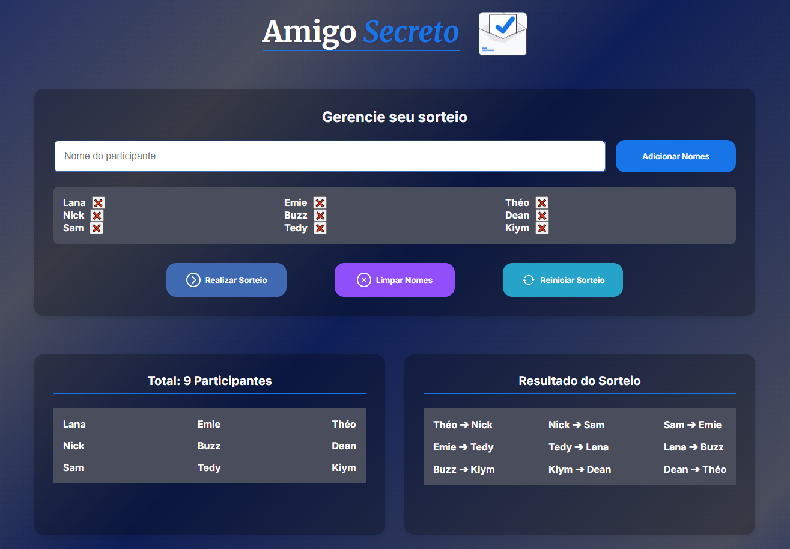

# 🎁 Amigo Secreto 🎁

## 🖼️ Captura de Tela

</br>

## 📊 Descrição

Este projeto é uma aplicação web simples para gerenciar sorteios de "Amigo Secreto". Ele permite adicionar participantes, realizar o sorteio e exibir os resultados de forma clara, organizada e garantindo que os sorteios não se repitam.

## 🌐 Acesse Online

Você pode acessar o projeto online diretamente pelo seu navegador ou smartphone através do link abaixo:

🔗 **[Acessar Amigo Secreto Online](https://amigo-secreto-six-chi.vercel.app/)**

## 📋 Funcionalidades

- **Adicionar Participantes**: Insira os nomes dos participantes que serão incluídos no sorteio.
- **Realizar Sorteio**: Realize o sorteio para determinar quem será o amigo secreto de cada participante.
- **Limpar Nomes**: Remova todos os nomes da lista de participantes.
- **Reiniciar Sorteio**: Reinicie o sorteio para realizar um novo sorteio com os mesmos ou novos participantes.
- **Exibir Resultados**: Veja o resultado do sorteio em tempo real.

## 🚀 Tecnologias Utilizadas

- **`HTML`**: Estrutura da página, com elementos semânticos e metodologia BEM aplicada, para melhorar a acessibilidade e leitura do código.
- **`CSS`**: Estilização responsiva e moderna, com uso de variáveis CSS e animações, adaptativa para telas menores.
- **`JavaScript`**: Lógica para gerenciar a lista de participantes, realizar o sorteio e garantir que não haja repetições.

## 📂 Estrutura do Projeto

- **`index.html`**: Contém a estrutura HTML da aplicação.
- **`style.css`**: Contém os estilos CSS para a aplicação.
- **`app.js`**: Contém a lógica JavaScript para gerenciar o sorteio.
- **`assets`**: Contém as imagens utilizadas.</br></br>

## 🛠️ Instalação

Para executar localmente, siga os passos abaixo:

1. **Clone o repositório**:

   ```bash
   [Clique aqui para acessar o repositório](https://github.com/devviniuchita/oracle_next-education_one_alura.git)
   ```

2. **Entre na pasta**:

   ```bash
   cd oracle_next-education_one_alura
   ```

3. **Abra o diretório**:

   ```bash
   cd challenger_amigo-secreto
   ```

4. **Abra o arquivo index.html no seu navegador**:
   ```bash
   start index.html  # No Windows
   open index.html   # No macOS
   xdg-open index.html # No Linux
   ```
   </br>

## 🤝 Contribuição

**Feedback's e Contribuições são bem-vindas!** Se você quiser melhorar o projeto, inserir funções etc.. siga os passos abaixo:

**1-** Faça um **fork** do projeto.

**2-** Crie uma **branch** para sua feature:

```bash
git checkout -b minha-feature
```

**3-** **Commit** suas mudanças:

```bash
git commit -m 'Adicionei uma nova feature'
```

**4-** **Push** para a **branch**:

```bash
git push origin minha-feature
```

**5-** Abra um **Pull Request**.</br></br>

## 📄 Licença

- Este projeto está sob a licença **MIT**. Veja o arquivo **[MIT LICENSE](LICENSE)** para mais detalhes.</br></br>

## 👏 Agradecimentos

- Inspirado no projeto base **Amigo Secreto** da [Alura](https://www.alura.com.br/).
- Créditos às imagens e ícones utilizados:
  - [Unsplash](https://unsplash.com/pt-br)
  - [unDraw](https://undraw.co/illustrations)
    </br></br>

## Feito com ❤️ por **Vinícius Uchita**.

- **📧 Contato**: viniciusuchita@gmail.com
